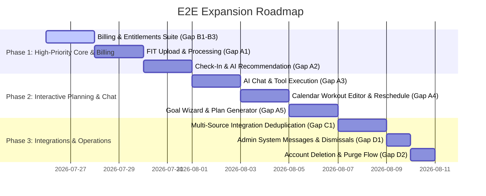

# E2E Test Suite Gap Analysis & Implementation Roadmap

## 1. Executive Summary

This guide outlines the complete **Gap Analysis** for the Journey Endurance Coaching Platform End-to-End (E2E) test suite.

While Journey Endurance Coaching Platform features a fast, isolated Playwright E2E testing architecture (`coach_e2e` PostgreSQL instance, Dragonfly Redis, seeded fixtures, parallel worker execution), a significant portion of existing test files operate as **shallow smoke tests** (verifying navigation, page titles, and element presence) rather than **deep functional tests** (verifying end-to-end state mutations, background tasks, API responses, and database updates).

This document serves as the master tracking reference for filling all E2E test gaps.

---

## 2. Audit of Existing E2E Test Suite

| Test File                                                                | Current Scope                                                                                                   | Classification         | Deficiencies / Required Enhancements                                                                        |
| :----------------------------------------------------------------------- | :-------------------------------------------------------------------------------------------------------------- | :--------------------- | :---------------------------------------------------------------------------------------------------------- |
| `e2e/tests/nutrition-fueling.spec.ts`                                    | Day-level fueling engine, window generation, meal locking, carb absorption calculations, weekly clock rendering | 🟢 **Deep Functional** | Gold standard reference specimen for E2E tests.                                                             |
| `e2e/tests/workout-analysis.spec.ts`                                     | AI workout analysis trigger, idempotency, data persistence                                                      | 🟢 **Deep Functional** | Extend to verify multi-sport threshold zone updates.                                                        |
| `e2e/tests/completed-workout-scope.spec.ts`                              | Local TSS overrides vs remote scope, outbound sync flags                                                        | 🟢 **Deep Functional** | Extend to cover bulk workout updates.                                                                       |
| `e2e/tests/sync-results-dashboard.spec.ts` / `sync-state-repair.spec.ts` | Integration sync status modals, state repair triggers                                                           | 🟡 **Moderate**        | Add end-to-end OAuth callback mock handling.                                                                |
| `e2e/tests/heartbeat-telemetry.spec.ts`                                  | Multi-turn chat turn metadata & heartbeat telemetry                                                             | 🟡 **Moderate**        | Focuses on telemetry metadata rather than user actions.                                                     |
| `e2e/tests/calendar-and-plans.spec.ts`                                   | Navigation to `/calendar`, `/plan`, `/training-plans`                                                           | 🔴 **Shallow Smoke**   | Missing workout creation, drag-and-drop rescheduling, interval step editing, and block generation.          |
| `e2e/tests/chat.spec.ts`                                                 | Page load, typing into input textarea without sending                                                           | 🔴 **Shallow Smoke**   | Missing message prompt submission, tool execution (`create_planned_workout`), and streaming text assertion. |
| `e2e/tests/dashboard.spec.ts`                                            | Navigation, refine modal open, morning check-in drawer open                                                     | 🔴 **Shallow Smoke**   | Missing check-in submission, AI recommendation generation, and recommendation acceptance workflow.          |
| `e2e/tests/settings-and-profile.spec.ts`                                 | Tab navigation for `/settings`, `/profile`, `/billing`                                                          | 🔴 **Shallow Smoke**   | Missing form updates (FTP, max HR, timezone, connected accounts, tier management).                          |
| `e2e/tests/workout-upload.spec.ts`                                       | File input dropzone visibility check                                                                            | 🔴 **Shallow Smoke**   | Missing actual `.fit` / `.gpx` file buffer upload, stream parsing, and activity creation assertion.         |
| `e2e/tests/activities-and-fitness.spec.ts`                               | Page loads for `/activities`, `/fitness`, `/nutrition`                                                          | 🔴 **Shallow Smoke**   | Missing activity filtering, sport-specific zone calculations, and weight/BP wellness charts.                |
| `e2e/tests/auth.spec.ts` / `admin-and-rbac.spec.ts` / `public.spec.ts`   | Login redirects, RBAC checks, public landing page rendering                                                     | 🟡 **Moderate**        | Good baseline access control; needs deeper role scenarios.                                                  |

---

## 3. Comprehensive Master List of E2E Test Gaps

### Category A: Core Interactive User Workflows

#### Gap A1: FIT File Ingestion & Parsing Pipeline (`e2e/tests/workout-upload.spec.ts`)

- **Objective**: Test uploading binary `.fit` activity files through UI and backend ingestion.
- **Scenario Steps**:
  1. Login as standard athlete (`authedPage`), navigate to `/workouts/upload`.
  2. Attach sample `.fit` file buffer (e.g. `e2e/fixtures/fit/sample-ride.fit`).
  3. Submit upload form and wait for `ingest-fit-file.ts` task completion.
  4. Assert redirect or update on `/activities`.
  5. Verify DB record in `Workout` table containing calculated metrics (TSS, Normalized Power, Intensity Factor, Heart Rate stream, Power stream).
  6. Test fallback mechanism `reconstructSessionFromRecords` for FIT files lacking a main session message.

#### Gap A2: Full Morning Check-In & AI Recommendation Loop (`e2e/tests/dashboard.spec.ts`)

- **Objective**: Validate morning wellness submission, background recommendation generation, and UI updates.
- **Scenario Steps**:
  1. Open morning check-in drawer (`/dashboard?focus=checkin`).
  2. Fill out sleep metrics (hours, quality), fatigue score, muscle soreness, and mental stress.
  3. Click "Submit Check-In".
  4. Verify background tasks `daily-checkin.ts` and `recommend-today-activity.ts` execute.
  5. Assert updated Recommendation card on Dashboard displaying adapted training advice formatted for the athlete's local date.
  6. Open "Refine" modal, submit feedback prompt, verify updated recommendation.

#### Gap A3: AI Chat & Tool Execution Flow (`e2e/tests/chat.spec.ts`)

- **Objective**: Validate AI prompt submission, tool invocation, WebSocket updates, and state persistence.
- **Scenario Steps**:
  1. Navigate to `/chat`.
  2. Type prompt: _"Schedule a 90-minute Zone 2 Endurance Ride for tomorrow at 8am"_.
  3. Submit message.
  4. Intercept/verify tool call execution (`create_planned_workout`) and real-time task status updates via `useUserRuns` WebSocket.
  5. Verify AI response confirms workout creation.
  6. Navigate to `/calendar` and verify the newly planned workout appears with correct title, duration, and target power zones.

#### Gap A4: Structured Workout Creation & Interval Step Editor (`e2e/tests/calendar-and-plans.spec.ts`)

- **Objective**: Validate manual workout creation, structured step editing, and rescheduling.
- **Scenario Steps**:
  1. Navigate to `/calendar`, click "+ Add Workout" on target cell.
  2. Fill out title, sport type (`RIDE`), duration (60m), and target TSS.
  3. Open Interval Step Editor; add Warmup (10m @ 50% FTP), Work (4x5m @ 105% FTP / 3m recovery), Cooldown (10m @ 50% FTP).
  4. Save workout; verify `PlannedWorkout` row created in DB with structured `intervalSteps` JSON.
  5. Drag/reschedule the workout cell to a new date.
  6. Verify date update in database while respecting timezone boundaries.

#### Gap A5: Goal Wizard & Training Block Generator (`e2e/tests/plans.spec.ts`)

- **Objective**: Validate end-to-end plan creation via Goal Wizard.
- **Scenario Steps**:
  1. Navigate to Goal Wizard (`/plans/wizard`).
  2. Input target goal (e.g. "Gran Fondo Peak Performance", target date 12 weeks out, 10 hours/week availability).
  3. Complete wizard and trigger `generate-training-block.ts` background task.
  4. Assert structured block phases (Base 1, Base 2, Build, Peak, Taper) appear on `/plan` and workouts populate the calendar.

---

### Category B: Billing, Entitlements & Tiered Pricing (`e2e/tests/billing-and-entitlements.spec.ts`)

#### Gap B1: Tier Entitlement Gating & State Enforcement

- **Objective**: Validate feature gating across Free ($0), Supporter ($8.99/mo), and Pro ($14.99/mo) plans.
- **Scenario Steps**:
  1. Login as Free user; navigate to `/settings/billing`. Assert plan badge displays "FREE".
  2. Verify Pro feature locks (e.g., Deep AI Analysis tab on workout detail is blurred with "Pro Feature" badge, Proactive AI tips toggle is disabled).
  3. Verify manual sync button is present instead of auto-sync status.

#### Gap B2: Stripe Webhook Synchronization & Customer Portal

- **Objective**: Test Stripe webhook events and entitlement state updates.
- **Scenario Steps**:
  1. Trigger simulated Stripe webhook (`customer.subscription.created`, `mode: subscription`, tier: `PRO`) via `/api/stripe/webhook`.
  2. Assert user DB record updates (`subscriptionTier: PRO`, `subscriptionStatus: ACTIVE`).
  3. Reload `/settings/billing`; verify plan status updates to "Pro", next renewal date displays, and locked features unlock across the app.
  4. Trigger `customer.subscription.updated` with status `CANCELED` (cancel at period end). Verify user retains Pro access until `subscriptionPeriodEnd` (Grace Period).
  5. Trigger `customer.subscription.deleted`. Verify user tier cleanly reverts to `FREE`.
  6. Validate `/api/stripe/portal-session` returns valid redirect URL for active subscribers.

#### Gap B3: Lifetime Access (`CONTRIBUTOR` Status)

- **Objective**: Validate lifetime grant immunity from Stripe sync downgrades.
- **Scenario Steps**:
  1. Set athlete `subscriptionStatus: CONTRIBUTOR`, `subscriptionTier: PRO`.
  2. Send Stripe webhook `customer.subscription.deleted`.
  3. Assert user retains `PRO` tier and `CONTRIBUTOR` status without downgrade.

---

### Category C: Integrations & Webhook Ingestion (`e2e/tests/webhooks.spec.ts`) 🟢 **COMPLETED**

#### Gap C1: Multi-Source Webhook Ingestion & Deduplication

- **Objective**: Test incoming webhooks from Strava, Intervals, Whoop, and Oura.
- **Scenario Steps**:
  1. POST mock Strava `activity.create` webhook payload to `/api/webhooks/strava`.
  2. POST mock Intervals.icu sync payload for the exact same start time and duration.
  3. Assert deduplication logic ensures only 1 `Workout` record is created in the database.
  4. POST mock Oura sleep/readiness webhook to `/api/webhooks/oura` alongside Withings weight payload to `/api/webhooks/withings`.
  5. Assert biometrics correctly merge into `Wellness` model without score conflicts.

---

### Category D: Admin Operations & System Safety 🟢 **COMPLETED**

#### Gap D1: System Messages & User Dismissal (`e2e/tests/admin-and-rbac.spec.ts`)

- **Objective**: Test admin message broadcasting and athlete dismissal persistence.
- **Scenario Steps**:
  1. Authenticate as Admin (`adminPage`), navigate to `/admin/system-messages`.
  2. Create a global banner message (_"Scheduled Maintenance Tonight at 02:00 UTC"_).
  3. Switch to Athlete session (`authedPage`), navigate to `/dashboard`. Assert `SystemMessageCard` banner is visible.
  4. Click "Dismiss" on the banner.
  5. Verify `UserSystemMessageDismissal` record created in DB. Reload page and assert banner is no longer displayed.

#### Gap D2: Account Deletion & Purge Flow (`e2e/tests/danger-zone.spec.ts`)

- **Objective**: Test account deletion request from Danger Zone.
- **Scenario Steps**:
  1. Create a dynamic test user via API.
  2. Navigate to `/settings/danger-zone`, enter confirmation text, click "Delete Account".
  3. Verify `delete-user-account` background job runs to completion.
  4. Assert user row and all cascaded data (`Workout`, `PlannedWorkout`, `Wellness`, `Nutrition`, `ChatSession`, `OAuthToken`) are permanently deleted.
  5. Assert session cookie is invalidated and client redirects to `/login`.

---

### Category E: Timezone Resilience & Edge Cases 🟢 **COMPLETED**

#### Gap E1: Multi-Timezone Calendar & Recommendation Alignment

- **Objective**: Enforce strict user timezone handling across calendar and check-in prompts.
- **Scenario Steps**:
  1. Set user profile timezone to `America/Los_Angeles` (UTC-7/8). Seed workout for date `2026-07-26`.
  2. Verify `/calendar` and `/dashboard` present workout on July 26th (not July 25th 17:00).
  3. Change user timezone to `Asia/Tokyo` (UTC+9).
  4. Verify `/calendar` and `/dashboard` present workout on July 26th (not July 27th 02:00).

---

## 4. Prioritized Implementation Roadmap

---

## 5. Standard Practices for E2E Spec Development

When creating or modifying E2E spec files, strictly follow the principles in [docs/04-guides/e2e-testing.md](file:///Users/hdkiller/Develop/coach-wattz/docs/04-guides/e2e-testing.md):

1. **Page Object Model**: Put all element locators and page interactions in `e2e/pages/`.
2. **Auth Fixtures**: Use `authedPage` or `adminPage` from `e2e/fixtures/test-fixtures.ts`.
3. **State Isolation**: Ensure mutating tests create isolated dynamic records (e.g. timestamped emails or IDs) so parallel Playwright workers never collide.
4. **Targeted Execution**: Run only the active spec file (`pnpm exec playwright test e2e/tests/billing-and-entitlements.spec.ts`) during development. Run full `pnpm test:e2e` only upon feature completion.
